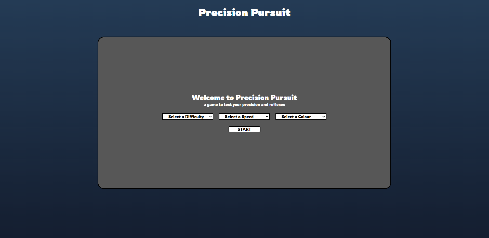

# Precision Pursuit

Welcome to Precision Pursuit, an aim trainer game for all you FPS gamers to improve your aim.

View the deployed app here: https://precision-pursuit.netlify.app/

Project Description: Users of all different skills levels can use Precision Pursuit to improve their accuracy. This is a game where you have 60s to hit as many targets as you can. The targets spawn on random spots on the screen and disappear after a few seconds if you don't hit them. You can choose from 3 different difficulties: easy, medium, and hard. The different difficulties change the size of the targets you must hit. You can choose from 3 different speeds: slow, normal, and fast. The different speeds change the time that the targets are on the screen before they disappear. You can also customize the targets to whatever colour you like.

The features of the app include:
- Choose from different difficulties/speeds based on your skill
- Keep track of your score and your accuracy level
- Change the colour of the targets to your preference

Some features I would like to include in the future:
- A high score feature that saves your highest score to local storage
- Increase the size of the targets the longer they are on the screen, more points the smaller the target is
- Ability to change your cursor to a customizable cross hair you would use in game
- Different game modes like how long does it take to hit 100 targets

## Local Build
### `npm start`

Runs the app in the development mode.\
Open [http://localhost:3000](http://localhost:3000) to view it in the browser.

## Screenshots

The apps start screen with no options selected

The apps start screen when you click start without selecting all options

The app on easy difficulty

The app on medium difficulty

The app on hard difficulty

The apps game over screen

The app on a mobile screen

